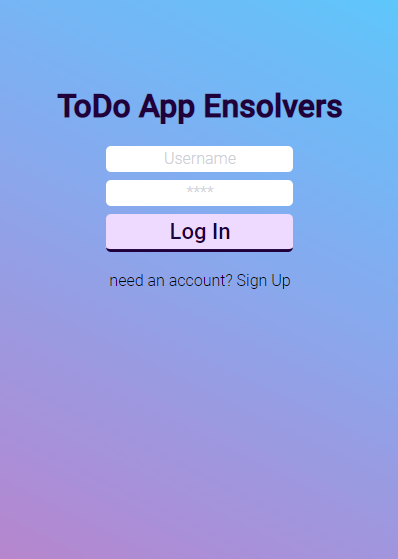
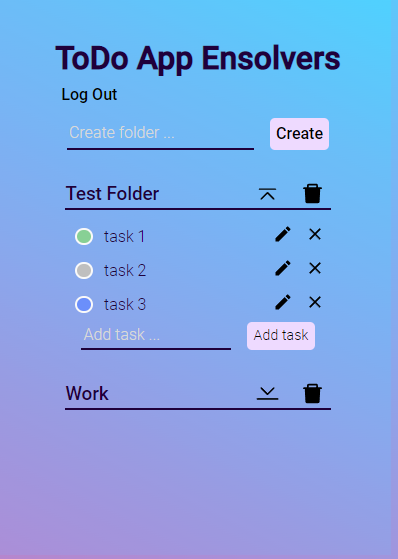

<h1>ToDo App - Ensolvers</h1>
<h3>SPA I made for an interview exercise.</h3>
<h2 align="center"><a href='https://to-do-challenge-nu.vercel.app/'>Try out the live demo!</a></h2>

It's done with React, Express, Sequelize and PostgreSQL.  For css I used Sass and CSS Modules.

- React 18
- Express 4.17
- PostgreSQL 14
- Sequelize 6.3

To run the app, you need to create a DB 'todoapp'.   Then, run npm i on both client and api folders.  
Once that's finished, npm run on the same both directories.

